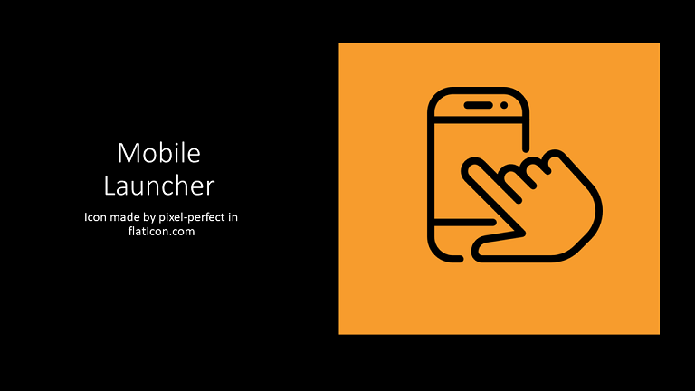

# MobileLauncher
Mobile launcher is a mobile application that brings key applications
together in a stash window for quick access. Avoiding the need to scroll or
swipe to look for a specific aapplication. 

## What brought forward this project

Users often have the problem of a saturated interface with apps. Some
of those applications may be installed and not even be in use. This 
at times results on users getting frustrated or distrcated with another
app.

## Ongoing Development

The project currently recreates the default home interface with a
bottom window that acts as a hub for the user to keep key applicaions.
As the project is currently under development, the next goal is to 
allow populating and removing apps through user control.
